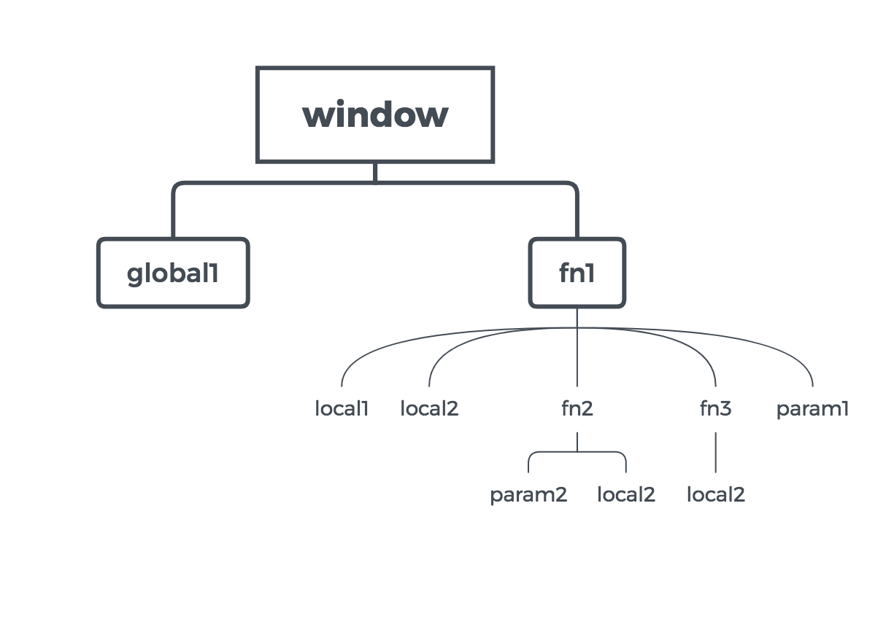

## 函数

### 函数的声明方式

* 匿名函数
```javascript
function() {
  return 1;
}
//这种浏览器方式会直接报错，因为只有函数对象，没有name，没有引用。所以我们要给他一个引用，如下：
var fn = function() {
  return 1;
}
//函数对象本身存放在堆内存中，fn记录的是函数的地址而不是函数本身
fn2 = fn;
//fn2也是存放的地址，指向堆内存当中的函数对象；

fn.name // fn
fn2.name // fn
```

* 具名函数
```javascript
function fn3() {
  return 3;
}
// fn3作用域为当前全局，可以在全局进行访问
fn3() // 3

var fn5 = `function fn4() {
  return 4;
}`
console.log(fn4()) // undefined,  因为fn4的作用域为高亮部分
console.log(fn5()) // 4, fn5的作用域为全局
```

* 箭头函数
```javascript
var fn6 = i => i + 1;
fn6(1) // 2

var fn7 = (i, j) => i + j;
fn7(1,2) // 3

var fn8 = (i, j) => {
  console.log('a');
  return i + j;
}
fn8(1,2) // a 3
```

> 箭头函数和（匿名函数，具名函数的区别）`this` 不同

### 词法作用域
```javascript
var global1 = 1
function fn1(param1){
  var  local1= 'local1'
  var local2 = 'local2')
  function fn2(param2){
    var local2 = 'inner local2'
    console.log(local1)
    console.log(local2)
  }
  function fn3(){
    var local2 = 'fn3 local2'
    fn2(local2)
  }
}
```
浏览器在执行该函数时会先解析你的语法生成一个词法树，来判断词法是否正确。
#### 词法树简图

如图：查找变量时，则会根据词法树去查找，现在当前层次去找，如果没有找到则到上一级去找。
> 注意：词法树只用于判断词法是否正确，跟值没有关系。
```javascript
var a = 1;
function fn() {
  console.log(a)
}
// 上例中根据词法树可以判断除 fn()中的a的引用为 外层的 var a = 1; 但是此时你并不能确定 console.log(a) 中为 1；原因如下：

var a = 1;
function fn() {
  console.log(a)
}
a = 2;
fn(); //此时打印出 2 而并不是 1；所以词法树只判断词法正不正确，跟值没有任何关系。
```

#### 深入阅读：
* [javascript的词法作用域](http://js8.in/2011/08/15/javascript%E7%9A%84%E8%AF%8D%E6%B3%95%E4%BD%9C%E7%94%A8%E5%9F%9F/)
* [静态作用域与动态作用域](https://zh.wikipedia.org/wiki/%E4%BD%9C%E7%94%A8%E5%9F%9F#.E9.9D.99.E6.80.81.E4.BD.9C.E7.94.A8.E5.9F.9F.E4.B8.8E.E5.8A.A8.E6.80.81.E4.BD.9C.E7.94.A8.E5.9F.9F)
* [Abstract Syntax Tree 抽象语法树简介](https://div.io/topic/1994)